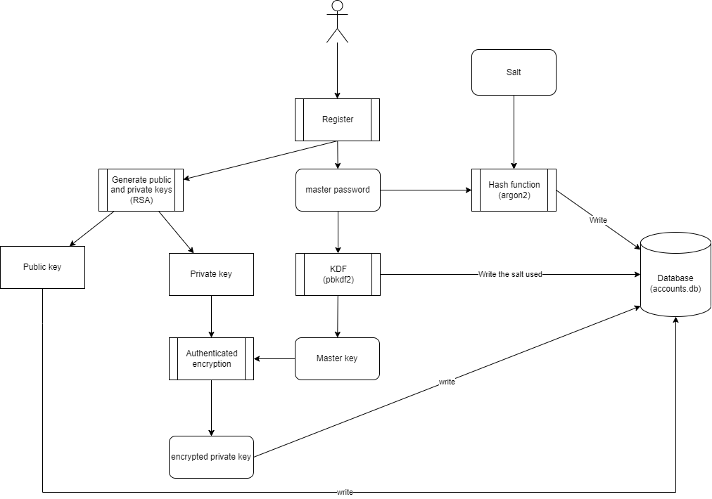
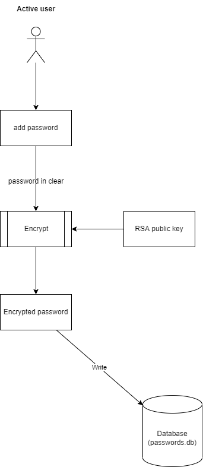
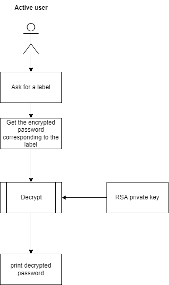
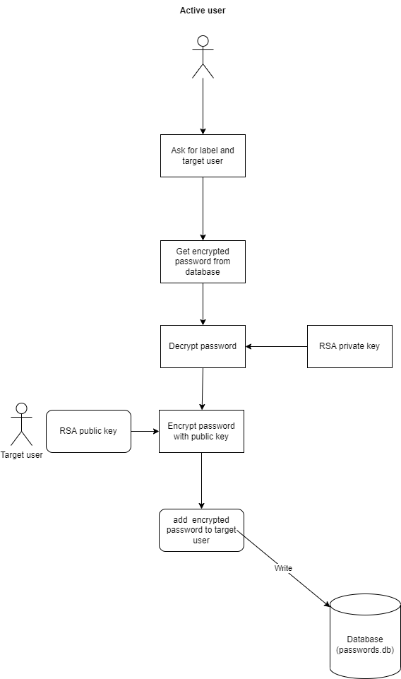
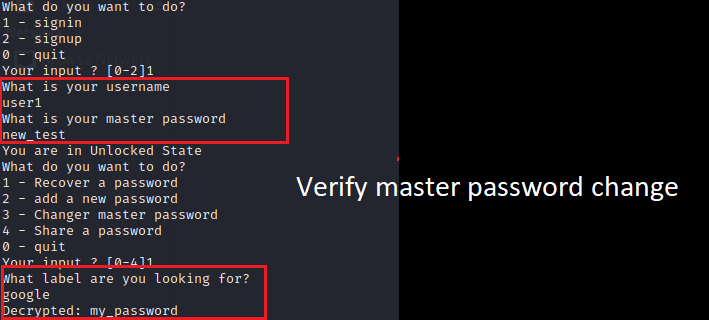

# Password manager
[TOC]

Know bugs

## Description of program

The user creates an account on the application. An RSA key pair is created and the RSA private key is encrypted with the key derived from the master password.

The hash of the master password is stored in the database.

When the user adds a new password to the database, it is encrypted with the RSA public key.

When  a user wishes to share a password with another user, he also uses the public key.

### Creating an account

### Add a password

### Recover a password

### Sharing a password

## Assets

| Name                        | Description                                                  | Protection                                                   |
| --------------------------- | ------------------------------------------------------------ | ------------------------------------------------------------ |
| RSA public key              | The RSA public key is used to encrypt a password             | no                                                           |
| RSA Private Key             | The RSA private key is used to decrypt a password            | Encrypted with the key derived from master password (chacha20_poly1305) |
| Master password             | The master password unlocks the state of the program.        | Only the hash of the password is stored in the database (argon2) |
| Derived Key master password | The the key derived from master password is necessary to decrypt the RSA private Key | It's not registered anywhere                                 |
| Stored password             | Passwords stored in the database                             | Encrypted with the RSA public key                            |

## Algorithm

### Password master storage

The hash of the master password is created with Argon2. 

The used library is argon2 : [https://docs.rs/argon2/0.4.0/argon2/](https://docs.rs/argon2/0.4.0/argon2/) with the default algorithm : **Argon2id**, a hybrid version combining both Argon2i and Argon2d.

The generated salt has a size of 128 bits.

An another library, rust-argon2, has only a salt of 64 bits. That's why it wasn't chosen.

Link :  [https://docs.rs/rust-argon2/latest/argon2/](https://docs.rs/rust-argon2/latest/argon2/)

### Master key derivation

From the password, a key is derived with the algorithm [pbkdf2](https://docs.rs/pbkdf2/latest/pbkdf2/#). The library used is pkdf2 : [https://docs.rs/pbkdf2/latest/pbkdf2/](https://docs.rs/pbkdf2/latest/pbkdf2/)

The algorithm used is different from that for the hash of the password, because an attacker could then obtain the key of the database.

### Asymmetric encryption

For the asymmetric encryption, it is the RSA algorithm. With a key of 2048 bits, it offers a satisfactory protection. It is easier to implement in Rust than an algorithm with elliptic curve.

The used library is openssl : [https://docs.rs/openssl](https://docs.rs/openssl)

An another library exists - RSA : [https://github.com/RustCrypto/RSA](https://github.com/RustCrypto/RSA). It has been audited, but the vulnerabilities found have not all been corrected by the developers...

For the padding, the openssl library offers three different paddings : PKCS1, PKCS1_OAEP, PKCS1_PSS

- PKCS1 is not IND-CPA secure
- PKCS1_PSS_PADDING is designed for signature, not encryption
-  PKCS1_OAEP is IND-CCA2, but it is vulnerable to Manger’s attack.

Therefore, OAEP padding is used because it is the better solution between the three possibilities.

Link to documentation : [https://docs.rs/openssl/latest/src/openssl/rsa.rs.html#50](https://docs.rs/openssl/latest/src/openssl/rsa.rs.html#50)

### Rust 

With the rust, the memory of an object will be erased as soon as the function ends. Its implementation is also more restrictive.

Unfortunately, it is a difficult language and I can not use its full potential. 

It is also possible to delete objects immediately from memory with `drop`, without waiting for the end of the function : https://doc.rust-lang.org/std/mem/fn.drop.html. Nevertheless, I didn't have time to use it.

## Limitation

- The Derived Key from master password is vulnerable to side channel attack. When a user is connected, it is available in memory. The attacker can therefore decrypt the RSA private key to then decrypt all passwords from the target user.
- The IVs drawn for chacha20_poly1305 are randomly drawn. It limits the number of private key we can encrypted.
- The salt for generate the derived Key from master password is stored in clear in the database. For a better security, we could encrypt the salt with the user's public key.

### Implementation - Exemple

