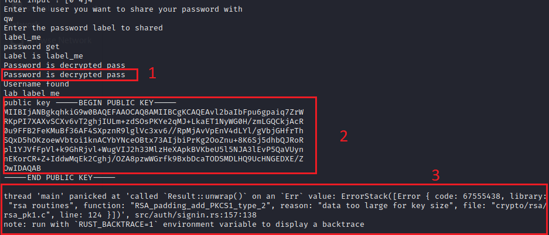

# Password manager
[TOC]

# Warning

This is a student project. This program should not be used in production or for your daily use.

## Description of program

The user creates an account on the application. An RSA key pair is created, and the RSA private key is encrypted with the key derived from the master password.

The hash of the master password is stored in the database (accounts.db).

When the user adds a new password to the database (passwords.db), it is encrypted with the RSA public key.

When a user wishes to share a password with another user, he also uses the public key.

### Creating an account

### Add a password

### Recover a password

### Sharing a password

## Assets

| Name                        | Description                                                  | Protection                                                   |
| --------------------------- | ------------------------------------------------------------ | ------------------------------------------------------------ |
| RSA public key              | The RSA public key is used to encrypt a password             | no [Improvement: authenticate the public key with a tag computed with the master key] |
| RSA Private Key             | The RSA private key is used to decrypt a password            | Encrypted with the key derived from master password (chacha20_poly1305) |
| Master password             | The master password unlocks the state of the program.        | Only the hash of the password is stored in the database (argon2) |
| Derived Key master password | The key derived from master password is necessary to decrypt the RSA private Key | It's not registered anywhere                                 |
| Stored password             | Passwords stored in the database                             | Encrypted with the RSA public key                            |

## Algorithm

### Password master storage

The hash of the master password is created with Argon2. 

The library used is argon2 : [https://docs.rs/argon2/0.4.0/argon2/](https://docs.rs/argon2/0.4.0/argon2/) with the default algorithm : **Argon2id**, a hybrid version combining both Argon2i and Argon2d.

The generated salt has a size of 128 bits.

Another library, rust-argon2, has only a salt of 64 bits. That's why it wasn't chosen.

Link :  [https://docs.rs/rust-argon2/latest/argon2/](https://docs.rs/rust-argon2/latest/argon2/)

### Master key derivation

From the password, a key is derived with the algorithm [pbkdf2](https://docs.rs/pbkdf2/latest/pbkdf2/#). The library used is pkdf2 : [https://docs.rs/pbkdf2/latest/pbkdf2/](https://docs.rs/pbkdf2/latest/pbkdf2/)

The algorithm used is different from that for the hash of the password, because an attacker could then obtain the key from the database.

### Asymmetric encryption

For the asymmetric encryption, it is the RSA algorithm. With a key of 2048 bits, it offers a satisfactory protection. It is easier to implement in Rust than an algorithm with elliptic curve.

The used library is openssl : [https://docs.rs/openssl](https://docs.rs/openssl)

An another library exists - RSA : [https://github.com/RustCrypto/RSA](https://github.com/RustCrypto/RSA). It has been audited, but the vulnerabilities found have not all been corrected by the developers...

For the padding, the openssl library offers three different paddings : PKCS1, PKCS1_OAEP, PKCS1_PSS

- PKCS1 is not IND-CPA secure
- PKCS1_PSS_PADDING is designed for signature, not encryption
- PKCS1_OAEP is IND-CCA2, but it is vulnerable to Manger’s attack.

Therefore, padding OAEP  is used because it is the better solution between the three possibilities.

Link for documentation : [https://docs.rs/openssl/latest/src/openssl/rsa.rs.html#50](https://docs.rs/openssl/latest/src/openssl/rsa.rs.html#50)

### RSA private key encryption

The algorithm used is chacha20_poly1300 to perform authentication encryption. Also, the aes-gcm128 algorithm did not work with the openssl library for some unknown reason.

## Rust 

### Memory

With the rust, the memory of an object will be erased as soon as the function ends. Its implementation is also more restrictive.

Unfortunately, it is a difficult language and I can not use its full potential. 

It is also possible to delete objects immediately from memory with `drop`, without waiting for the end of the function : [https://doc.rust-lang.org/std/mem/fn.drop.html](https://doc.rust-lang.org/std/mem/fn.drop.html). Nevertheless, I didn't have time to use it.

### Library

Personally, the crypto libraries were a big disappointment. Very few are audited and corrected. Moreover, many bugs are present.

## Limitation

- The Derived Key from master password is vulnerable to side channel attack. When a user is connected, it is available in memory. The attacker can therefore decrypt the RSA private key to then decrypt all passwords from the target user.
- The IVs drawn for `chacha20_poly1305` are randomly drawn. It limits the number of private keys we can encrypted.
- The salt for generate the derived Key from master password is stored in clear in the database. For a better security, we could encrypt the salt with the user's public key.
- Encrypted passwords can be modified by an attacker in the database. No tag calculation is performed. However, it is likely that the decryption will cause an error.

### Better solution

#### Password sharing

A better solution to shared password between user it's used a hybrid encryption instead of use only the public key of the user. For example with the KEM algorithm

Then to only add a password, it would be relevant to encrypt passwords with a sysmetric key (Derived from the master key) to encrypt the password.

#### Authenticate the public key

Morevoer, in the labo, the user's public key is not authenticated. I was planning to do it but I had too many errors in rust. An attacker that can write in the database can change easily change the public key. The user will therefore use  the attacker's public key.

For a better security, we can compute a tag on the public key with the master key.

When sharing a password, this public key cannot be verified because it requires the master password.

- **Function register**

Function add a password

#### 

### Implementation - Example

## Known bugs

- The feature `Shared password`does not work.

| Step | Description                                                  | Work |
| ---- | ------------------------------------------------------------ | ---- |
| 1    | Recover the password corresponding to the label with the user's private key | Yes  |
| 2    | Retrieve target user's public key                            | Yes  |
| 3    | Encrypt the password with the target user's public key       | No   |

Example

In this example, some information is displayed for debugging purposes. This is of course test data

- The generation of the master key is not correct.

## Evaluation

### Report

- Authentication 1/1
- Key derivation 1.7/3

 It's not a great idea to combine Argon2 and PBKDF2. You increase the amount of code and the risk of bugs.                      

The choice to do everything with asymmetric crypto is quite heavy and you lose performance. Also, the entries are not authenticated, which allows attacks l.                      

RSA-OAEP limits the size of your plain text but you explain in your report that hybrid encryption would be better, so not penalized 

- Password change 2/2 #Not explained in the report but ok in the code 
- Password sharing 1.5/2 

RSA-OAEP limits the size of your plain text (which implies the error you have) BONUS: Overall 6.2/8

### Implementation

- Login 1/1 
- Add password 1/1 
- Display password 1/1 
- Share password 1/2 

Not working due to RSA-OAEP 

- Change master password 1.5/2 #Panic 
- Password not in clear in memory 1/1 

Overall 6.5/8
